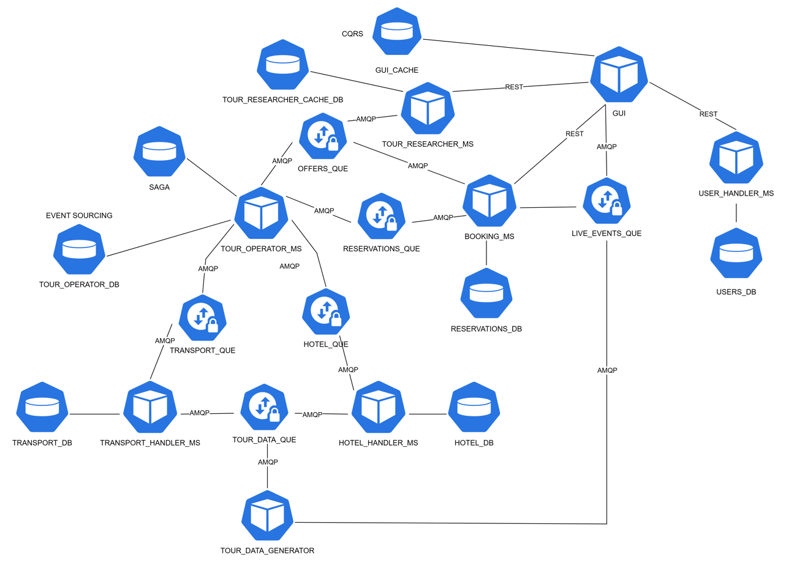

# Ogólna architektura systemu

- **REST** - Serwisy komunikują się protokołem HTTP
- **AMQP** - Serwisy komunikują się z kolejką RabbitMQ za pomocą protokołu AMQP
- **SYMBOL SZCZEŚCIANU** - Jeden serwis biznesowy
- **SYMBOL WALCA** - Jedna baza danych. Może być bezpośrednio związana z danym serwisem.
- **SYMBOL DWÓCH STRZAŁEK** - Jedna kolejka w RabbitMQ.
---
## Lista serwisów w systemie

- WEB_UI - warstwa prezentacji, czyli frontend.
- USER_HANDLER - serwis odpowiedzialny za uwierzytelnienie użytkowników.
- BOOKING_MS - serwis odpowiedzialny za obsługę rezerwacji oraz kupna wycieczek przez klienta.
- TOUR_RESEARCHER_MS - serwis odpowiedzialny za wyszukiwanie i listowanie wycieczek dla klienta.
- TOUR_OPERATOR_MS - serwis odpowiedzialny za tworzenie wycieczek, i aktualizowanie wycieczek dla innych serwisów.
- HOTEL_HANDLER_MS - serwis odpowiedzialny za pobieranie, przechowywanie oraz wydawanie informacji o zakwaterowaniu. Serwis ten symuluje pobieranie informacji o hotelach na świecie.
- TRANSPORT_HANDLER_MS - serwis odpowiedzialny za pobieranie, przechowywanie oraz wydawanie informacji o środkach transportu. Serwis ten symuluje pobieranie informacji o transporcie na świecie.
- TOUR_DATA_GENERATOR - serwis symulujący wydarzenia losowe jak np. wzorst kosztu hotelu, albo zapełnienie się miejsca w samolocie.

Większość serwisów będzie posiadała swoją własną bazę danych, z której będzie korzystała.